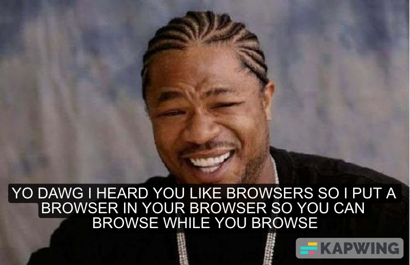

# mbkv browser

What's a browser without some dead memes?

## Build instructions:

* install bun
* `bun install && bun start`
* visit everyone's favorite new browser ladybird and connect to http://localhost:3000
* alternatively visit https://browser.mbkv.io on non-ladybird browsers (I have no idea why it doesn't work on ladybird. I tried and all I got is `Failed to load https://browser.mbkv.io/`. My guess is SSL?)

---

I did a lot of it within the jam. I did use a ~550 line HTML parser I made a
couple of weeks ago. I didn't know what was going to be included in the
browserjam so I wanted to make sure I'd have time to finish while writing most
of my code from scratch. I kind of regret it now since I'm fairly certain I
could have hacked together a non-compliant html parser for this very easily

contact info:

* Email: [me@mbkv.io](mailto:me@mbkv.io)
* ~Twitter~ 𝕏: [@mbkv_io](https://twitter.com/mbkv_io)

I'm more likely to respond via email.

